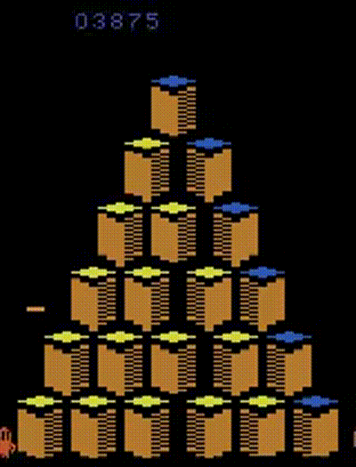

# Deep Q-Network (DQN) for Atari Games

This Repository creates a framework for benchmarking a DQN-Agent for loss of plasticity. It provides not only options to archive loss of plasticity by either training on difficult Atari Games for a long time or forcing overfitting on a RL MNIST variant but also provides options to mitigate or even reverse loss of plasticity

## Overview

### Deep Q-Network (DQN)

The Deep Q-Network is a deep reinforcement learning algorithm that extends Q-learning to handle high-dimensional state spaces. It employs a neural network to approximate the Q-function, which represents the expected cumulative future rewards for taking a specific action in a given state. This allows DQN to learn directly from raw sensory inputs, making it applicable to a wide range of tasks.

### Atari Games

The Atari 2600, a popular home video game console in the late 1970s and early 1980s, featured a diverse collection of games. These games serve as a benchmark for testing the capabilities of reinforcement learning algorithms. Each game in the Atari 2600 suite provides a unique environment with different challenges, making them an ideal testbed for training agents to generalize across a variety of tasks.

### RL MNIST Variant

The RL MNIST Variant, is a gym environment which enables RL-Agent to be benchmarked on the standart MNIST dataset. This is archived by interpreting the actions chosen by the Agent as Class Labels and rewarding correct Classification. The advantage of an RL environment opposite to using the underlying RL-Agent's network on standart MNIST is, that this approach enables setting baselines for training environmnets without introducing new variables by shifting from an RL to a supervised Classification Problem.

## Table of Contents

- [Introduction](#introduction)
- [Overview](#overview)
- [Getting Started](#getting-started)
  - [Prerequisites](#prerequisites)
  - [Installation](#installation)
- [Usage](#usage)
- [Training](#training)
- [Config](#config)
- [Contributing](#contributing)
- [License](#license)

## Getting Started

### Prerequisites

To run this project, you will need the following:

- Python 3.x
- PyTorch
- Gym (OpenAI)

### Installation

1. Clone the repository:

```bash
git clone https://github.com/jako9/master.git
```

2. Install the required dependencies:

```bash
pip install -r requirements.txt
```

## Usage

To train and evaluate the DQN agent, follow the steps outlined below:

1. Set up the required dependencies as described in the [Installation](#installation) section.

2. Train the DQN agent:

```bash
python dqn_atari.py --config example_config.json
```

To customize your own training environment, alter the hyperparameters in the example_config.json.
An indepth explanation of each hyperparameter can be found in the [Config](#config) section.

3. Evaluate the trained agent:

Evaluation process has been done during end of training, but if you want to run evaluation separately, just run `dqn_eval.py` and change the game environment.

## Training

The training process involves the following steps:

1. Preprocess raw game frames to reduce dimensionality.
2. Initialize a deep neural network to approximate the Q-function.
3. Initialize a replay buffer to store experiences.
4. For each episode, perform the following steps:
   - Select an action using an epsilon-greedy policy.
   - Execute the action in the environment and observe the next state, reward, and terminal flag.
   - Store the experience in the replay buffer.
   - Sample a batch of experiences from the replay buffer and perform a Q-learning update step.
   - Update the target Q-network periodically.

## Config

exp_name -> The name of the Game (either "Mnist-v0" or an Atari Game)
seed -> a set seed for deterministic randomness
torch_deterministic -> deterministic torch
cuda -> wether or not to utilize cuda
track -> wether or not to track training using Wandb
wandb_project_name -> Wandb project name
wandb_entity -> Wandb Entity (can be null)
capture_video -> wether or not to capture intermediate videos whilest training (evaluation will be captured regardeless)
video_path -> path to video files
save_model -> wether or not to save the model after training
hf_entity -> hf Entity

total_timesteps -> How many steps in the environment one Concept should take
learning_rate -> Learning rate
num_envs -> How many environments should be initialized parallely (Only 1 supported right now)
buffer_size -> size of the Replay Buffer
gamma -> Discount factor
tau -> Factor for soft or hard target network updates (0, no updates to 1, hard updates)
target_network_update_freq -> how often the target network should catch up to the Q-Network
batch_size -> Batch size for sampling from the Replay Buffer
start_e -> Epsilon at the start
end_e -> Epsilon at the end
exploration_fraction -> Portion over which the epsilon should interpolate from start_e to end_e (0,1)
learning_starts -> steps to be taken before any learning takes place
train_frequency -> How many steps should be taken between Q-Network updates
plasticity_injection -> After how many Concept Drifts the Plasticity Injection should take place (0 for no injeciton at all)
num_retrains -> Number of Concept Drifts

### Game: `Q-Bert`

Here's a GIF of the agent playing `Q-Bert`:



### Game: `MS PacMan`

Here's a GIF of the agent playing `MS PacMan`:


## License

This project is licensed under the MIT License - see the [LICENSE](LICENSE) file for details.

## Acknowledgment
This repository inspired by CleanRL
```
@article{huang2022cleanrl,
  author  = {Shengyi Huang and Rousslan Fernand Julien Dossa and Chang Ye and Jeff Braga and Dipam Chakraborty and Kinal Mehta and João G.M. Araújo},
  title   = {CleanRL: High-quality Single-file Implementations of Deep Reinforcement Learning Algorithms},
  journal = {Journal of Machine Learning Research},
  year    = {2022},
  volume  = {23},
  number  = {274},
  pages   = {1--18},
  url     = {http://jmlr.org/papers/v23/21-1342.html}
}
```
